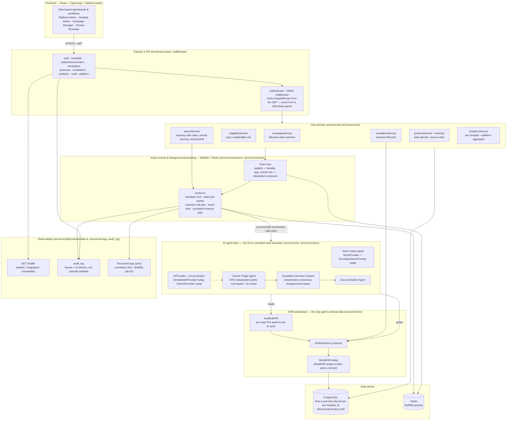

# Architecture (Phase 12, PRD §24/§33 deliverable)

One system diagram, per PRD §24's own instruction to avoid multiple repetitive ones — everything else in `docs/` is a deep-dive on one slice of this picture (queue design, AI usage, multi-tenancy, escalation management, workflows/events, observability). This document is the map; those are the territory.

## System diagram

## Major services and their boundaries

Grouped by the 13 domains PRD §24 lists explicitly, mapped onto the diagram above:

| PRD §24 domain | Where it lives | Notes |
|---|---|---|
| Frontend / authentication | `web/`, `server/src/routes/auth.ts`, `server/src/middleware/auth.ts` | Single JWT issuer; role read from the token, never a request param |
| Tenant management | `server/src/db/scope.ts`, `server/src/services/hospitalService.ts` | `HospitalScope` — mintable only by an access guard — is the "evidence a check ran" pattern threaded through every layer below |
| Campaign management | `server/src/services/campaignService.ts` | One guarded transition function per lifecycle action, not a generic status setter |
| Eligibility | `server/src/services/eligibilityService.ts` | Pure function, independently unit-testable, per PRD §7's "evaluated consistently and explainably" |
| Queue / scheduling | `server/src/services/queueService.ts`, `server/src/worker.ts` | See `docs/queue-design.md` — including the Phase 8 concurrency-race fix |
| Outbound calling | `server/src/voice/` | `VoiceProvider`/`SimulatedVoiceProvider` — see `docs/voice-provider.md` for the real-telephony swap-in |
| AI agents | `server/src/ai/` | See `docs/ai-usage.md`; this is the diagram's `AIBoundary` cluster |
| Protocol retrieval | `server/src/services/protocolRetrievalService.ts` | See `docs/protocols-knowledge-retrieval.md` |
| Healthcare data / EHR integration | `server/src/ehr/` | See `docs/ehr-abstraction.md`; the diagram's `EHRBoundary` cluster |
| Background processing | `server/src/worker.ts`, `server/src/queue/` | BullMQ; capacity is reserved in Postgres before a job exists (see queue-design.md) |
| Workflows / notifications | `server/src/events/`, `server/src/services/notificationService.ts` | See `docs/workflows-events.md` |
| Analytics | `server/src/services/analyticsService.ts` | See `docs/dashboards-analytics.md` |
| Observability | `server/src/lib/systemHealth.ts`, `server/src/lib/audit.ts`, `server/src/ai/circuitBreaker.ts` | See `docs/observability-reliability.md` |

## The five boundaries PRD §24 calls out explicitly

1. **AI ↔ controlled tools.** Every AI-initiated read/write crosses through `EHRInterface`, never a raw query — the "AI request → authorization → schema validation → business rules → execution → audit → result" pipeline from `docs/ai-usage.md`. `HospitalScope` is the authorization proof; Zod schemas (`server/src/ai/types.ts`) are the validation; `AuditedEHR` is the audit.
2. **Queue / calling infrastructure.** Postgres is the single source of truth for "is there room" (an advisory-lock-protected capacity check, see `docs/queue-design.md`); BullMQ is purely the distribution mechanism for work already granted room. The two never need to coordinate settings.
3. **The EHR abstraction.** `MockEHR` today, `RealEHR` later — same `EHRInterface` contract, zero calling-code changes. See `docs/ehr-abstraction.md`.
4. **Async events / workflows.** Durable-write-then-enqueue publishing, two-layer idempotent consumption (BullMQ `jobId` dedup + a `processedAt` marker). See `docs/workflows-events.md`.
5. **Observability.** Real dependency-backed health states, structured AI observability logging, and an audit trail for both human and AI-driven "important operations." See `docs/observability-reliability.md`.

## API surface (PRD §24: "should support authentication, hospitals/users, patients/encounters, campaigns, queue state, calls, escalations, protocols/knowledge, EHR operations, notifications, analytics, evaluation, and health")

| PRD-named surface | Route(s) |
|---|---|
| Authentication | `POST /api/v1/auth/login` |
| Hospitals / users | `POST/GET/PATCH /api/v1/platform/hospitals*`, `POST /api/v1/platform/hospitals/:id/users`, `GET/PATCH /api/v1/hospitals/me*`, `server/src/routes/patients.ts`'s staff-adjacent reads |
| Patients / encounters | `server/src/routes/patients.ts`, `server/src/routes/encounters.ts` |
| Campaigns | `server/src/routes/campaigns.ts` (full lifecycle + workload estimate) |
| Queue state | `GET /api/v1/campaigns/:id/queue-health` |
| Calls | Surfaced through the patient operational view (`getPatientTimeline`'s `outreachAttempts`) and an escalation's transcript (`GET /api/v1/escalations/:id`) — there is no separate top-level "calls" resource, since a call only ever exists as an attempt against a specific outreach task; PRD §17 groups this under "documentation and call records," not a distinct API domain |
| Escalations | `server/src/routes/escalations.ts` (full reviewer lifecycle) |
| Protocols / knowledge | `server/src/routes/protocols.ts`, including `/protocols/search` (the retrieval engine, exposed for inspection ahead of the AI layer calling it in-process) |
| EHR operations | Not directly exposed over HTTP — `EHRInterface` is called by application services and the AI pipeline (server-internal), matching PRD §6's "AI must never directly manipulate database tables" (there's equally no reason for a human-facing route to bypass the same boundary) |
| Notifications | `GET /api/v1/escalations/:id/notifications` — added in Phase 12 while writing this document, closing a gap where the underlying table/service existed since Phase 6 but had no read route |
| Analytics | `GET /api/v1/analytics/hospital`, `GET /api/v1/platform/analytics` |
| Evaluation | **Deliberately a CLI script, not an HTTP endpoint** (`npm run safety:evaluate`) — see `docs/safety-evaluation.md`. Reproducibility and CI-friendliness (no database/network dependency at all) were prioritized over API exposure; an evaluation run isn't a request a hospital user would ever make through the product UI |
| Health | `GET /health` |

## Data model relationships (PRD §24)

Hospitals are the tenant root; every hospital-scoped table carries an indexed `hospital_id` and is RLS-forced (`docs/multi-tenancy.md`). The core relationship chain: **hospital → patient → encounter (a discharge) → outreach task (per campaign) → outreach attempt (per call) → escalation (optional, from a connected attempt's AI assessment)**. Supporting tables hang off this chain rather than forming a separate structure: `communications`/`observations`/`conditions`/`medications`/`procedures`/`care_plans`/`tasks` all key off `patient_id` (and often `encounter_id`); `app_events` and `audit_log` key off whichever resource they describe (`resourceType`/`resourceId`), not a fixed foreign key, since they log against many different resource types by design; `notifications` key off the same pattern. Indexing follows the access pattern established from Phase 0 onward: every hospital-scoped table indexes `hospital_id` (the tenant-isolation query every read already filters on) plus whatever column its own service's hot-path queries filter on next (status, patient/task id, priority) — see each table's own schema file for the specific choice and its `docs/*.md` companion for why.

## What was deliberately not built

- **A separate architecture-diagramming tool or generated diagram** — a hand-authored Mermaid diagram (renders natively on GitHub, readable as plain text otherwise) was judged sufficient for "one clear diagram," per PRD §24's own preference against multiple repetitive ones.
- **Small supplementary sequence diagrams** — PRD §24 allows them "only where they materially improve understanding." The single most complex flow (a connected call through triage → consensus → documentation → EHR write) is already narrated step-by-step in `docs/ai-usage.md`'s "controlled tools" section and `server/src/ai/pipeline.ts`'s own comments; a redundant diagram of the same flow wasn't judged to add anything a careful reader wouldn't already get from those.
